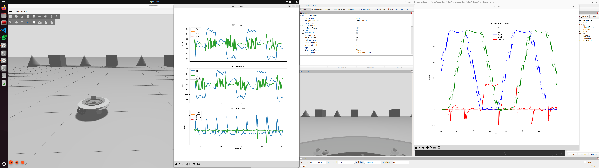

<p align="center">
  
</p>

# HAMR Holonomic Robot (ROS 2 Jazzy)

**Brief**: ROS 2 Jazzy packages for a holonomic base with an **offset turret**. Includes **URDF/Xacro**, **Gazebo (gz sim) setup**, a **PID controller**, and a **waypoint-based reference trajectory** for quick simulation.

---

## Installation (Ubuntu 24.04 + ROS 2 Jazzy)

### 1) Workspace & clone
```bash
mkdir -p ~/ros2_ws/src
cd ~/ros2_ws/src
git clone https://github.com/cedrichld/hamr_holonomic_robot.git
```
### 2) Source ROS 2 (now and on login)
```bash
source /opt/ros/jazzy/setup.bash
# Optional: add to ~/.bashrc
echo 'source /opt/ros/jazzy/setup.bash' >> ~/.bashrc
```
### 3) Build
```bash
cd ~/ros2_ws
colcon build --symlink-install
source ~/ros2_ws/install/setup.bash
# Optional: add to ~/.bashrc
echo 'source ~/ros2_ws/install/setup.bash' >> ~/.bashrc
```
### 4) Resources for meshes/STLs (required)
```bash
export GZ_SIM_RESOURCE_PATH="$(ros2 pkg prefix hamr_description)/share":$GZ_SIM_RESOURCE_PATH 
# Optional: add to ~/.bashrc
echo 'export GZ_SIM_RESOURCE_PATH="$(ros2 pkg prefix hamr_description)/share":$GZ_SIM_RESOURCE_PATH"' >> ~/.bashrc
```

### Run the simulation
**Terminal A** (Gazebo + bringup):
```bash
source /opt/ros/jazzy/setup.bash
source ~/ros2_ws/install/setup.bash
ros2 launch hamr_bringup hamr.launch.xml
```
**Terminal B** (reference trajectory):
```bash
source /opt/ros/jazzy/setup.bash
source ~/ros2_ws/install/setup.bash
ros2 run reference_trajectory waypoint_traj
```

### Waypoints (example)
For now, `waypoint_traj` publishes a discretized set of waypoints:
```python
# SQUARE Trajectory
points = np.array([  
    # x,  y,   yaw
    [0.0, 0.0, 0.0],  
    [5.0, 0.0, 0.0],
    [5.0, 5.0, 0.0],
    [0.0, 5.0, 0.0],
    [0.0, 0.0, 0.0]
])
```
### To start Micro ROS Bridge
Run your controller (publishing the topics as it is), just one more extra step, in a separate terminal (or add to your launch file) run the bridge:
```bash
ros2 run hamr_uros_bridge relay_node
```